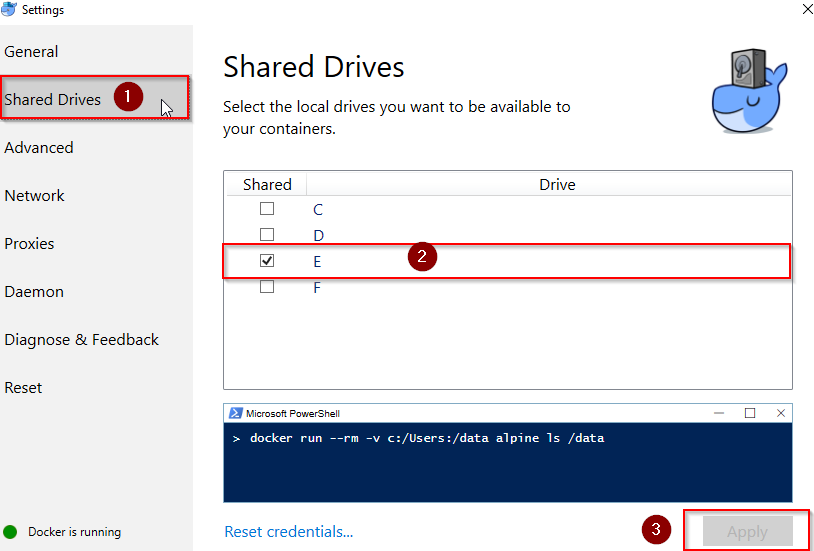
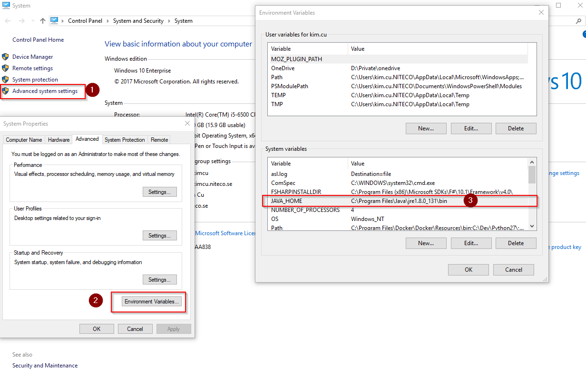
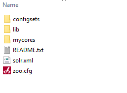

# Install Solr 6.6.2 via docker

After installed, we'll have a **Solr with SSL** which is running in Docker

## Pre-Requisites

1. [Docker for window](https://store.docker.com/editions/community/docker-ce-desktop-windows)
2. [Java JRE 1.8 or higher (required for Solr)](http://www.oracle.com/technetwork/java/javase/downloads/jre8-downloads-2133155.html)
3. Microsoft PowerShell® version 5.0 or later

## Configurations

### Shared Drives settings for Docker

For example, we configure the **E:/** as a __shared drive__ 

### Define a JAVA_HOME

- It must be defined from **Environment Variables**

## Getting Started

1. Clone this repository to your local
    * __Notes:__

        + It must be located at the drive that we configured as **shared drive** from Docker. 
        + Since we configured the **E:/** drive as **shared drive** from Docker in preceding; thus, the source code must be cloned at this drive; for instance, **_E:/solr-docker_** 

2. Open **Window PowerShell** as **Administrator**, then execute the **".\solr.ps1"** script and wait to finish
3. Eventually, verify the Solr from browser by the Url: https://localhost:8983

### Notes:

It might be need to check the **SolrData** which is mapped from Docker's container has been initialized. Just simple access the cloned repo folder (i.e. **_E:/solr-docker/SolrData_**)

# Uninstall Solr 6.6.2

1. Open **Window PowerShell** as **Administrator**
2. Execute the **".\solr.ps1 -remove"** script (within **-remove** parameter)